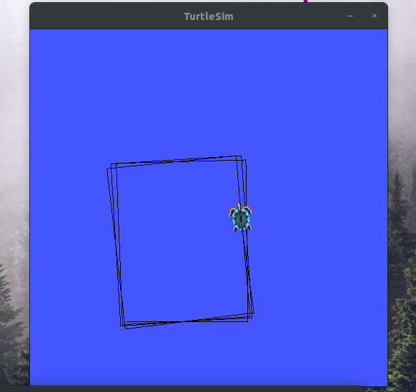
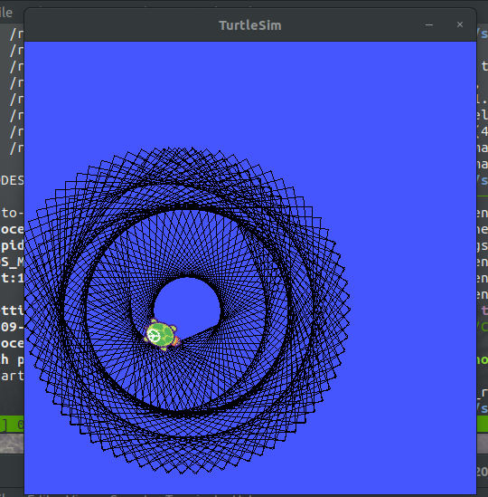
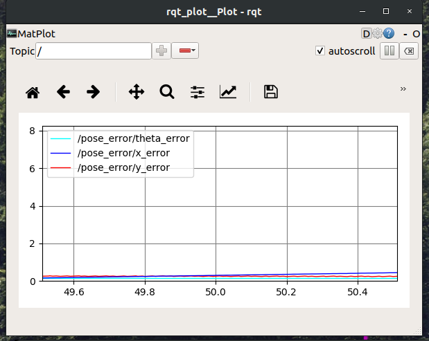

# Turtle Rect Package
#### By Josh Cohen

## Description:
This package interfaces with the turtlesim package to command the turtle to command velocities such that the turtle follows a rectangular path in a manner defined by the parameters in *config/turtle_rect.yaml*

## To Launch:
`roslaunch tsim trect.launch` to launch with error plotter
`roslaunch tsim trect.launch plot_gui:=false` to launch without error plotter

## File Structure:
* config/turtle_rect.yaml - configuration file containing rectangular path parameters as well as robot velocity parameters and frequency of velocity publishing

* launch/trect.launch - launchfile that loads configuration parameters to parameter server, launches turtlesim_node, turtle_rect node, and , optionally, the error plotter node.

* msg/PoseError.msg - the msg definition file for our error messages, published on /pose_error

* src/turtle_rect.cpp - the main file, defines turtle_rect node and TurtleRect object. Performs pubs, subs, service calls, and service implementations to provide functionallity to this trajectory commanding and error tracking node

## Screenshots:

## Link to Video:
https://youtu.be/-sAzRHv7nr8
